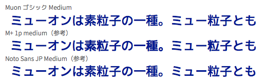

Muon ゴシック フォントファミリー
==============================

M+ 1p フォントのひらがな・カタカナを、Noto Sans JP（源ノ角ゴシック）フォントの漢字・記号に組み合わせた日本語フォントファミリーです。

## 概要

Muon は「無音」ではなく「ミューオン」！　名前の由来は M+ フォントからの連想ですが、ちょっと突飛すぎた……？（ミューオンは素粒子の一種。ミュー粒子とも）

M+ FONTS PROJECT が配布している M+ 1p フォントと、Google & Adobe が配布している Noto Sans JP フォントの合成フォントです。単に機械的に合成するのではなく、漢字とのサイズ合わせや行の高さ調整を施しています。

- M+ FONTS http://mplus-fonts.osdn.jp/
- Noto CJK http://www.google.com/get/noto/help/cjk/

### 見本

### ウェイト

オリジナルのファミリーから表記をいじってます。

- Regular → 漢字は Noto Sans JP DemiLight、仮名は M+ 1p regular
- Medium → 同 Medium、同 medium
- Bold → 同 Bold、同 bold
- Heavy → 同 Black、同 heavy

## ライセンス

Muon ゴシックは、Noto Sans JP フォントのライセンスに基づいて、SIL Open Font License 1.1 を引き継ぎます。自由にご利用、複製、再配布などしていただいて構いません。改変したものを再配布する場合、約束事（名称変更、ライセンスの継承、、）が何点かあるので従いましょう。Muon ゴシックも従っています。

現状のまま無保証で提供されるもので、使用（や使用不能）によって不利益が発生しても一切責任を負いません。

## Contact

近いうちに日記ブログに Muon ゴシックの作成方法や途中困った箇所とかの記事を書くつもりです！

- 日記ブログ http://zwxadz.hateblo.jp/
- @gilbert_yumu http://twitter.com/gilbert_yumu
